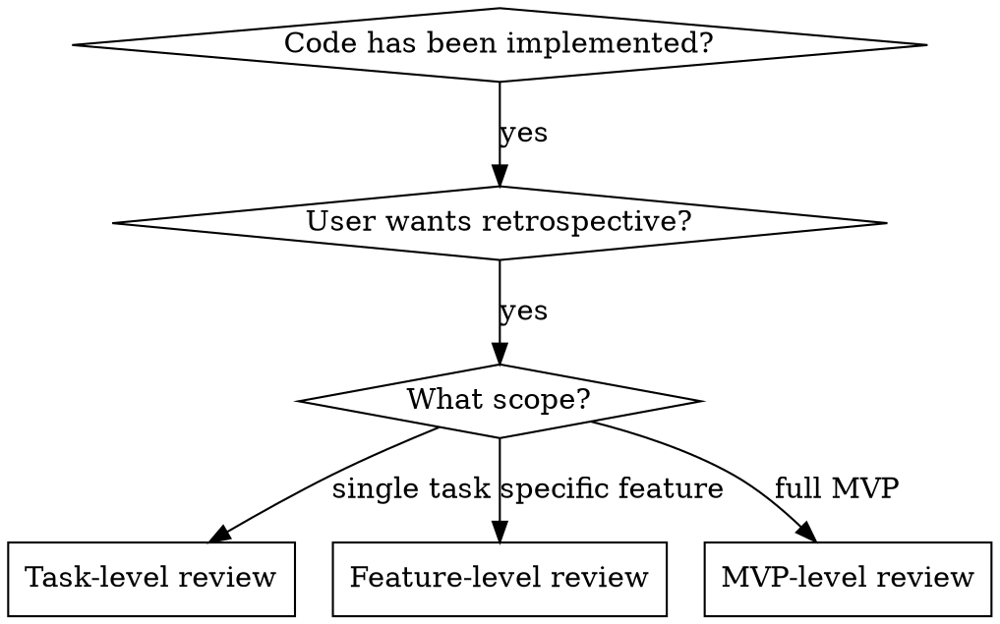
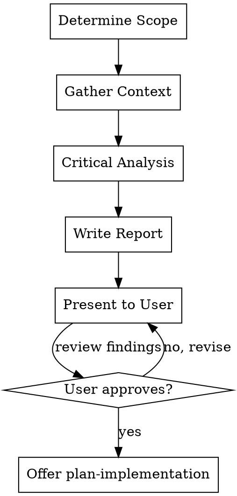

# Critique

## Overview

Review implemented code with critical eyes to identify refactoring opportunities and improvements.

**Core principle:** Critical eyes, honest assessment. If you wouldn't write it this way knowing what you know now, say so.

**The retrospective question:** "Knowing what we know now, if we were to reimplement this from scratch, what would we do differently?"

## ALWAYS REMEMBER

Before doing ANYTHING, read through `AGENTS.md` and adhere to those guidelines.

## When to Use



**Use when:**

- Code has been implemented (task, feature, or MVP level)
- User wants to identify refactoring opportunities
- Before major version releases
- When technical debt is accumulating

**Don't use when:**

- No code exists yet → Nothing to review
- Simple one-line changes → Overkill
- User just wants a quick check → Use code-reviewer agent instead

## The Process



### Step 1: Determine Scope

Ask the user to clarify the scope:

> "What scope should this retrospective cover?
>
> 1. A specific task
> 2. A specific feature
> 3. The full MVP"

### Step 2: Gather Context

Based on scope, read:

**Task-level:**

- The task file with development log
- All files created/modified in the task
- Related design spec sections

**Feature-level:**

- All task files for the feature
- All files in the feature's directory structure
- The feature's design spec
- Integration points with other features

**MVP-level:**

- All task files
- All source code
- The MVP design spec
- Architecture documentation

### Step 3: Critical Analysis

Analyze the code with these lenses:

**Code Complexity**

- Are there files >300 lines that should be split?
- Are there functions >50 lines that should be decomposed?
- Are there deeply nested conditionals (>3 levels)?
- Are there circular dependencies?
- Is there duplicated code that could be consolidated?

**Code Fragmentation**

- Is logic spread across too many files?
- Are there "utility" files collecting unrelated functions?
- Are there files with unclear or multiple responsibilities?
- Is there excessive indirection (A calls B calls C calls D)?

**Missed Opportunities**

- Could patterns from one area improve another?
- Were there simpler approaches not considered?
- Are there premature abstractions that add complexity?
- Are there missing abstractions that would simplify?

**What Should Have Been Done Before**

- Were there prerequisites that would have made this easier?
- Was the order of tasks suboptimal?
- Were there infrastructure needs that should have been addressed first?

### Step 4: Write Retrospective Report

Create the report based on scope:

**MVP Refactor:**
`docs/specs/implementation/mvp/refactor/MVP-CRITICAL-RETROSPECTIVE-REPORT.md`

**Feature Refactor:**
`docs/specs/implementation/features/<feature-name>/refactor/<feature-name>-CRITICAL-RETROSPECTIVE-REPORT.md`

**Structure:**

```markdown
# Critical Retrospective Report

## Scope

[What was reviewed: task/feature/MVP level, files covered]

## Executive Summary

[2-3 sentences on overall assessment and key recommendations]

## What Went Well

- [Aspect that worked well]
- [Another positive]

## Critical Findings

### 1. [Finding Category - e.g., "Excessive Complexity in Authentication"]

**Current State:**
[Description of the problem with file:line references]

**Impact:**
[Why this matters: maintenance burden, bug risk, onboarding difficulty]

**Recommended Refactor:**
[Specific, actionable recommendation]

**Effort:** Low | Medium | High
**Priority:** P0 (critical) | P1 (important) | P2 (nice to have)

### 2. [Finding Category - e.g., "Fragmented Error Handling"]

[Same structure as above]

## What Should Have Been Done Before

1. [Prerequisite that would have helped]
2. [Infrastructure that should have existed]

## Refactor Priorities

### Phase 1 (Must Fix)

1. [Finding #X] - [Brief description]
2. [Finding #Y] - [Brief description]

### Phase 2 (Should Fix)

1. [Finding #Z] - [Brief description]

### Phase 3 (Nice to Have)

1. [Finding #W] - [Brief description]

## Implementation Notes

[Any specific guidance for implementing the refactor]

## Files Affected

- `path/to/file1.ext` - [change type]
- `path/to/file2.ext` - [change type]

## Success Criteria

- [ ] [Measurable outcome 1]
- [ ] [Measurable outcome 2]
```

### Step 5: Present to User

> "Critical retrospective written to `[path]`. Key findings: [2-3 bullet points]. Would you like to review the report first, or proceed with `/write-plan` to create refactor tasks?"

## The Critical Lens

**Be direct:** This is not the time for gentle feedback. If something is wrong, say so clearly.

**Be specific:** Every finding needs file:line references and concrete recommendations.

**Be balanced:** If the code is actually good, say so. Don't manufacture criticism.

### Questions to Ask

1. "If I were implementing this from scratch, would I do it this way?"
2. "Would a new team member understand this in 5 minutes?"
3. "If I had to change one thing, would I have to change 10 other things?"
4. "Is this solving the right problem, or a symptom?"
5. "What would make this 50% simpler?"

## Common Rationalizations

| Excuse                            | Reality                                                       |
| --------------------------------- | ------------------------------------------------------------- |
| "The code works, don't change it" | Working code can be unmaintainable. Technical debt compounds. |
| "Refactoring is risky"            | NOT refactoring is riskier. Complexity makes changes harder.  |
| "We'll fix it later"              | Later never comes. Technical debt increases velocity drag.    |
| "It's too late to change"         | Better late than never. Each day with bad code costs more.    |
| "Don't be negative"               | Honest criticism prevents wasted time. Be critical, not mean. |
| "The user won't care"             | Users care when bugs multiply and features slow down.         |
| "It's good enough for now"        | Good enough becomes unmaintainable faster than you think.     |

## Red Flags - STOP and Reassess

- Being "nice" instead of direct
- Skipping file:line references
- Forgetting to note what went well
- Manufacturing criticism when code is good
- Recommending changes without understanding impact
- Ignoring effort vs priority trade-offs
- Making vague findings without specific recommendations
- Skipping the "what went well" section

**All of these mean: You're not providing a useful retrospective. Reset and follow the process.**

## Self-Check Before Presenting

- [ ] Every finding has file:line references
- [ ] Every problem has a recommended solution
- [ ] Priority and effort are considered
- [ ] "What went well" section is included
- [ ] Specific, not vague findings
- [ ] Report structure followed

## Example: Fragmented Validation

**Current State:**
Email validation duplicated in `src/auth/signup.ts:15-22`, `src/profile/update.ts:42-49`, and `src/admin/users.ts:78-85`. Each uses slightly different regex patterns.

**Impact:**

- Bug fix requires changing 3 files
- Inconsistent validation behavior across app
- New signup forms may copy wrong pattern

**Recommended Refactor:**
Extract to `src/utils/validation.ts` with single `isValidEmail()` function. Update all call sites.

**Effort:** Low
**Priority:** P1 (important)

## Output Locations

| Scope            | Location                                                                                                     |
| ---------------- | ------------------------------------------------------------------------------------------------------------ |
| MVP Refactor     | `docs/specs/implementation/mvp/refactor/MVP-CRITICAL-RETROSPECTIVE-REPORT.md`                                |
| Feature Refactor | `docs/specs/implementation/features/<feature-name>/refactor/<feature-name>-CRITICAL-RETROSPECTIVE-REPORT.md` |

## Transition Out

After the retrospective is complete and the user has reviewed it:

> "Critical retrospective complete. Ready to create a refactor plan from these findings. Would you like to proceed with `/write-plan` with category tag `[MVP-REFACTOR|FEATURE-REFACTOR]`?"

Do NOT invoke write-plan directly—let the user decide when to proceed.

The retrospective report serves as input to `/write-plan` with category tag `MVP-REFACTOR` or `FEATURE-REFACTOR`.

## Common Mistakes

| Mistake                 | Fix                                      |
| ----------------------- | ---------------------------------------- |
| Being too gentle        | Direct criticism serves the user better  |
| Being mean-spirited     | Be critical of code, not people          |
| Vague findings          | Every finding needs file:line references |
| No recommendations      | Every problem needs a proposed solution  |
| Missing priority        | Help user understand what to fix first   |
| Forgetting positives    | Acknowledge what went well               |
| Manufacturing criticism | If code is good, say so                  |

## Remember

The goal is the best, most readable, most maintainable product—not being nice. But don't be critical just for the sake of it. Be critical because honest assessment prevents technical debt from compounding.
