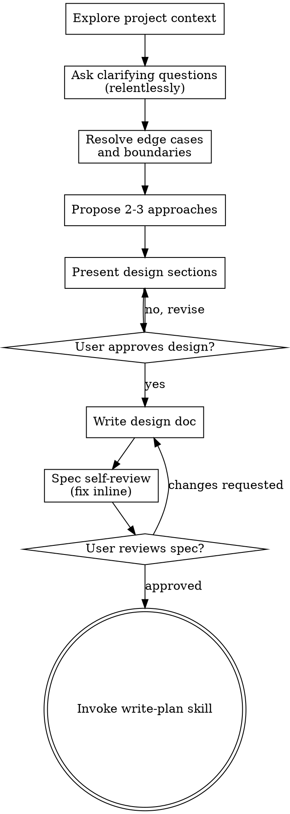

# Extract MVP Design Spec

Transform ideas—from vague notions to well-defined concepts—into focused MVP design specs through relentless structured dialogue.

## Overview

This skill applies **relentless systematic inquiry** to extract clarity and scope for an MVP. It handles the full spectrum: ideas that need problem discovery, concepts with clear features but no tech stack, and everything in between. The output is always an MVP-focused design spec with a justified tech stack choice and all edge cases, boundaries, and failure modes resolved.

**Core principle:** One question at a time, relentlessly probe every branch, YAGNI ruthlessly, user has final say on what's in the MVP.

## Relentless Inquiry

This skill does not ask the minimum — it asks until every branch of the decision tree is resolved. One question at a time, but NO question skipped. Every assumption probed, every edge case walked, every failure mode confronted.

**Inquiry rules:**

1. **Provide your recommended answer for every question.** Don't ask open-ended questions without showing your reasoning. Present your recommendation and let the user confirm, reject, or refine it.
2. **If a question can be answered by exploring the codebase or researching, do that instead of asking.** Prefer investigation over interrogation. Only ask when the answer genuinely requires the user's judgment.
3. **Walk every branch of the decision tree.** When a decision has multiple paths, trace each to its conclusion before moving on. Don't collapse branches prematurely.
4. **Never accept vagueness as resolution.** If the user says "I'm not sure" or "whatever you think", provide your recommendation with explicit reasoning and ask them to confirm or reject it.
5. **Edge cases are requirements, not afterthoughts.** Every feature has boundary conditions, failure modes, adversarial inputs, and partial states. These must be resolved in the spec, not discovered during implementation.
6. **Assumptions must be explicit.** Every assumption you're making — about users, data, performance, dependencies, deployment — write it down. Unstated assumptions are untested assumptions.
7. **Challenge "simple" and "obvious".** The simpler something seems, the more likely it hides unexamined assumptions. Double down on questioning when things seem straightforward.

## ALWAYS REMEMBER

Before doing ANYTHING, read through `AGENTS.md` and adhere to those guidelines.

<HARD-GATE>
Do NOT invoke any implementation skill, write any code, scaffold any project, or take any implementation action until you have presented a design and the user has approved it. This applies to EVERY project regardless of perceived simplicity.
</HARD-GATE>

## Anti-Pattern: "This Is Too Simple To Need A Design"

Every project goes through this process. A todo list, a single-function utility, a config change — all of them. "Simple" projects are where unexamined assumptions cause the most wasted work. The design can be short (a few sentences for truly simple projects), but you MUST present it and get approval.

## When to Use

**Use this skill for ANY idea that needs an MVP design spec:**

- Vague notions ("something like X but for Y")
- Half-formed concepts with some features in mind
- Well-defined ideas needing tech stack decisions
- "What do you think of this idea?" requests
- Starting a new project from scratch

**What changes based on clarity:**

- Vague ideas → More exploration questions (problem space, alternatives, users, edge cases)
- Defined concepts → Skip to constraints, edge cases, and tech stack directly

## Checklist

You MUST create a task for each of these items and complete them in order:

1. **Explore project context** — check files, docs, recent commits
2. **Ask clarifying questions** — relentlessly, one at a time, provide recommended answers
3. **Resolve edge cases and boundaries** — walk every branch of the decision tree
4. **Propose 2-3 approaches** — with trade-offs and your recommendation
5. **Present design** — in sections scaled to their complexity, get user approval after each section
6. **Write design doc** — save to `docs/specs/design/mvp/YYYY-MM-DD-<topic>-mvp-design.md` with all resolved details
7. **Spec self-review** — check for placeholders, contradictions, missing edge cases, ambiguity, scope
8. **User reviews written spec** — ask user to review spec file before proceeding
9. **Transition to implementation** — invoke write-plan skill to create implementation plan

## Process Flow



**The terminal state is invoking write-plan.** Do NOT invoke execute-plan, or any other implementation skill. The ONLY skill you invoke after this process is write-plan.

## The Process

### Phase 1: Explore Intent

Establish foundational understanding. **Adapt depth based on concept clarity:**

**For vague ideas** (ask these one at a time, provide your recommended answer for each):

1. **Problem statement** — What problem does this solve? Whose problem? My recommendation: [your analysis]
2. **Current alternatives** — What exists? Why is it insufficient? My recommendation: [your analysis]
3. **Target user** — Who is this for? (be specific — not "everyone") My recommendation: [your analysis]
4. **Success vision** — What does success look like? My recommendation: [your analysis]
5. **Failure vision** — What does failure look like? What would make this project not worth doing? My recommendation: [your analysis]
6. **Hard constraints** — Time, budget, regulatory, technical, platform? My recommendation: [your analysis]
7. **Assumptions you're making** — What are you taking for granted that might be wrong? My recommendation: [your analysis]
8. **Who might misuse this?** — What would adversarial or careless usage look like? My recommendation: [your analysis]
9. **Anti-requirements** — What must this explicitly NOT do? My recommendation: [your analysis]
10. **What have you already tried?** — What went wrong with previous attempts? My recommendation: [your analysis]
11. **Good enough vs perfect** — What's the minimum acceptable quality? What's the aspirational target? My recommendation: [your analysis]

**For well-defined concepts** (skip or accelerate, but do NOT skip edge cases):

- Validate understanding: "So you're building [X] for [Y] to solve [Z]. Sound right?"
- Still probe: "What happens when [Z] can't be fully solved?"
- Still probe: "What are the edge cases of [X]?"
- Move directly to constraints and edge case questioning

**Always ask one question at a time.** Wait for the answer before proceeding.

**Check project context first:**

- Review current project state (files, docs, recent commits)
- Assess scope: if the request describes multiple independent subsystems, flag this immediately and help decompose
- If too large for a single spec, help break into sub-projects. Each gets its own spec → plan → implementation cycle.

**Under pressure (user in a rush, "ASAP", "skip to the point"):**

- Acknowledge urgency briefly, but hold firm on process
- Frame questions to be extra sharp and specific
- Explain that 5 minutes of clarity saves hours of misdirected work
- Provide your recommended answer immediately so the user only needs to confirm/reject, not generate from scratch

### Phase 2: Extract Core Problem

Synthesize what you've learned and validate:

> "So the core problem is [X]. The gap with existing solutions is [Y]. Does that capture it?"

If confirmed, probe deeper:

1. **Is this the real problem or a symptom?** — What would solving a different (simpler) problem achieve? My recommendation: [your analysis]
2. **Who experiences this most acutely? Least?** — Are we solving for the right user? My recommendation: [your analysis]
3. **What happens if we don't solve this?** — Is the cost of inaction clear? My recommendation: [your analysis]
4. **What partial solutions exist?** — Can we get 80% of the value with 20% of the work? My recommendation: [your analysis]

If not confirmed, ask what's missing and re-synthesize.

### Phase 3: Resolve Edge Cases and Boundaries

**This is the grill-me phase.** Walk every branch of the decision tree, resolving dependencies between decisions one by one. Do not proceed until every identified edge case has a resolution.

Ask these one at a time, providing your recommended answer:

1. **Scale boundaries** — What happens at 0 users? At 10x expected? At 1000x? What breaks first? My recommendation: [your analysis]
2. **External dependency failures** — What happens when each external service is down, slow, or returns bad data? My recommendation: [your analysis]
3. **Data boundary conditions** — Empty data, max-size data, malformed data, concurrent modifications? My recommendation: [your analysis]
4. **Adversarial inputs** — What's the worst input a user could provide? What's the worst sequence of actions? My recommendation: [your analysis]
5. **Partial and inconsistent states** — What states can the system be in between operations? What if an operation is interrupted mid-way? My recommendation: [your analysis]
6. **Security boundaries** — Who can access what? What are the trust boundaries? What must be authenticated vs public? My recommendation: [your analysis]
7. **Regulatory and compliance** — Any data handling requirements, privacy rules, audit needs? My recommendation: [your analysis]
8. **Deployment and migration** — How does this deploy? Rollback? Migrate from any previous state? My recommendation: [your analysis]
9. **Performance under load** — What are the latency requirements? Throughput? What degrades gracefully? My recommendation: [your analysis]
10. **Data loss scenarios** — What data is critical? What's the recovery path if lost? My recommendation: [your analysis]
11. **Concurrent access** — Multiple users, multiple sessions, race conditions? My recommendation: [your analysis]
12. **Invariants** — What must always be true regardless of state? My recommendation: [your analysis]

**For each edge case, the resolution must be explicit in the spec.** "Handle gracefully" is not a resolution — specify exactly what happens.

**If the user says "that won't happen":** Provide your reasoning for why it could, and ask them to explicitly confirm it's excluded. If confirmed, record it as an explicit assumption.

### Phase 4: Identify MVP Features

Work with the user to distinguish essential from nice-to-have:

1. **Start with use cases** — "What's the minimum viable workflow?"
2. **Apply YAGNI ruthlessly** — Challenge every feature
3. **Sequence for value** — What's the smallest valuable slice?
4. **User has final say** — If the user insists a feature is required for MVP, accept it (but challenge first)

**For each proposed feature, ask (one at a time):**

- What's the smallest version of this that delivers value?
- What happens if we cut this entirely? What breaks?
- What's the cost of including it? (code complexity, maintenance burden, testing surface)
- What dependencies does it have on other features?
- What edge cases does it introduce?
- How will we know it's working correctly? How will we know it's broken?
- What's the failure mode when this feature fails?

**My recommendation for each:** [provide your analysis of whether this belongs in MVP and why]

Output: A prioritized feature list with MVP clearly marked, each with edge cases and failure modes documented.

### Phase 5: Select Tech Stack

Evaluate options based on the refined concept:

**Considerations:**

- User's stated preferences (if any)
- Problem domain fit (e.g., real-time vs batch processing)
- Deployment constraints (serverless, self-hosted, edge)
- Development speed vs performance tradeoffs

**Process:**

1. Propose 2-3 tech stack options
2. For each: explain fit, tradeoffs, and implications
3. Recommend one with clear justification
4. Get user agreement

**Then probe deeper (one at a time, with recommendations):**

5. **Migration path** — If we need to change this decision later, how painful is it? My recommendation: [your analysis]
6. **Operational complexity** — How hard is this to run, monitor, debug in production? My recommendation: [your analysis]
7. **Failure modes introduced** — What new failure modes does this stack bring? My recommendation: [your analysis]
8. **Talent and ecosystem** — How easy to find help, libraries, examples? My recommendation: [your analysis]
9. **Lock-in risk** — What would it cost to migrate away from this choice? My recommendation: [your analysis]

### Phase 6: Present Design

Once you understand what you're building, present the design:

- Scale each section to its complexity: a few sentences if straightforward, up to 200-300 words if nuanced
- Ask after each section whether it looks right so far
- Cover: architecture, components, data flow, error handling, testing, edge cases, failure modes
- Be ready to go back and clarify if something doesn't make sense

**Design for isolation and clarity:**

- Break the system into smaller units that each have one clear purpose, communicate through well-defined interfaces, and can be understood and tested independently
- For each unit, you should be able to answer: what does it do, how do you use it, and what does it depend on?
- Can someone understand what a unit does without reading its internals? Can you change the internals without breaking consumers? If not, the boundaries need work.

**Working in existing codebases:**

- Explore the current structure before proposing changes. Follow existing patterns.
- Where existing code has problems that affect the work, include targeted improvements as part of the design
- Don't propose unrelated refactoring. Stay focused on what serves the current goal.

### Phase 7: Write Design Spec

Create the design document at `docs/specs/design/mvp/YYYY-MM-DD-<topic>-mvp-design.md`:
(User preferences for spec location override this default)

**Structure:**

```markdown
# [Project Name] - MVP Design Spec

## Context

[Problem statement, target user, why now, relationship to existing solutions]

## Core Problem

[The specific problem being solved, validated with user]

## Assumptions and Constraints

[Every assumption made during design — about users, data, performance, dependencies, deployment, regulations]
- [Assumption 1]: [why we believe this, what happens if wrong]
- [Assumption 2]: [why we believe this, what happens if wrong]

### Hard Constraints

- [Constraint 1: e.g., must run on Raspberry Pi, must work offline]
- [Constraint 2]

## Anti-Requirements

[What this must explicitly NOT do — boundaries that prevent scope creep]
- [Anti-requirement 1]: [why excluded]
- [Anti-requirement 2]: [why excluded]

## MVP Feature Set

### Must-haves (Phase 1)

#### Feature 1

- Purpose: [why this feature exists]
- Behavior: [what it does, including edge cases and boundary conditions]
- Failure mode: [what happens when this feature fails or is used incorrectly]
- Decisions made: [key design decisions and rationale]

#### Feature 2

- Purpose: [why this feature exists]
- Behavior: [what it does, including edge cases and boundary conditions]
- Failure mode: [what happens when this feature fails or is used incorrectly]
- Decisions made: [key design decisions and rationale]

### Nice-to-have (Phase 2+, defer)

- Feature A: [brief description, why deferred]
- Feature B: [brief description, why deferred]

## Edge Cases and Boundary Conditions

[All edge cases identified during inquiry, with resolution for each]
- [Edge case 1]: [resolution]
- [Edge case 2]: [resolution]

## Failure Modes and Degradation

[How the system behaves when things go wrong]
- [Failure mode 1]: [detection, response, recovery]
- [Failure mode 2]: [detection, response, recovery]

## Tech Stack

**Choice:** [Stack components]

**Justification:**
- [Reason 1: fits use case X]
- [Reason 2: aligns with constraint Y]

**Tradeoffs acknowledged:**
- [What we're giving up and why it's acceptable]

**Migration path:** [How to change this decision later if needed]

## Architecture Overview

[High-level structure, key components, data flow]

## Invariants

[System properties that must always hold, regardless of state]
- [Invariant 1]
- [Invariant 2]

## Success Criteria

- [Criterion 1: specific, testable]
- [Criterion 2: specific, testable]

## Decision Log

[Record of key decisions made during design, with reasoning]

| Decision | Options Considered | Chosen | Rationale |
|----------|-------------------|--------|-----------|
| [Decision 1] | [A, B, C] | [A] | [why] |
| [Decision 2] | [X, Y] | [Y] | [why] |
```

### Phase 8: User Approval

Present the spec to the user:

> "Design spec written to `[path]`. Key points: [2-3 sentence summary]. Does this capture your vision? Any changes before we proceed?"

Wait for approval. Iterate if needed.

### Phase 9: Spec Self-Review

After writing the spec document, look at it with fresh eyes:

1. **Placeholder scan:** Any "TBD", "TODO", incomplete sections, or vague requirements? Fix them.
2. **Internal consistency:** Do any sections contradict each other? Does the architecture match the feature descriptions?
3. **Scope check:** Is this focused enough for a single implementation plan, or does it need decomposition?
4. **Ambiguity check:** Could any requirement be interpreted two different ways? If so, pick one and make it explicit.
5. **Edge case coverage:** Are all identified edge cases addressed in the spec? Any edge cases from Phase 3 missing?
6. **Assumption audit:** Are all assumptions explicit? Any assumptions that are "obvious" but unstated?
7. **Failure mode coverage:** Does the design handle every identified failure mode? Or are some left to "handle gracefully" without specifics?
8. **Invariant verification:** Are all invariants testable? Could any be violated by the described behavior?

Fix any issues inline. No need to re-review — just fix and move on.

### Phase 10: User Reviews Spec

After the spec review loop passes, ask the user to review the written spec before proceeding:

> "Spec written and committed to `<path>`. Please review it and let me know if you want to make any changes before we start creating the implementation plan."

Wait for the user's response. If they request changes, make them and re-run the spec review loop. Only proceed once the user approves.

### Phase 11: Transition to Implementation

Once the design spec is approved:

> "Ready to break this down into actionable tasks. Would you like to proceed with `/write-plan`?"

Do NOT invoke implementation skills directly—let the user decide when to proceed.

## Quick Reference

| Question Type        | Purpose                  | Example                                              |
| -------------------- | ------------------------ | ---------------------------------------------------- |
| Problem extraction   | Identify the pain point  | "What's frustrating about current solutions?"        |
| Use case discovery   | Find essential scenarios | "Walk me through how you'd use this"                 |
| Constraint gathering | Understand boundaries    | "Offline-first? Real-time collaboration? Both?"      |
| Success criteria     | Define "done"            | "What makes this successful vs failure?"             |
| Tradeoff exploration | Reveal priorities        | "Prefer simplicity or power-user features?"          |
| Edge case probing    | Find hidden assumptions  | "What happens when the network drops mid-operation?" |
| Failure mode mapping | Ensure graceful handling | "What does the user see when this service is down?"  |
| Adversarial thinking | Find security/misuse     | "What's the worst input someone could provide?"      |
| Invariant checking   | Ensure system integrity  | "What must always be true, no matter what?"          |
| Assumption surfacing | Make implicit explicit   | "What are you assuming about the user's environment?"|

## Key Principles

- **One question at a time** — Don't overwhelm with multiple questions
- **Provide your recommended answer** — Show your reasoning, let the user confirm or reject
- **Explore before asking** — If the codebase or docs can answer the question, look there first
- **YAGNI ruthlessly** — Remove unnecessary features from all designs
- **Explore alternatives** — Always propose 2-3 approaches before settling
- **Incremental validation** — Present design, get approval before moving on
- **Walk every branch** — Trace each decision path to its conclusion
- **Be flexible** — Go back and clarify when something doesn't make sense
- **User has final say** — If the user insists a feature is required for MVP, accept it (but challenge first)
- **Edge cases are requirements** — Resolve them in the spec, not during implementation
- **Assumptions must be explicit** — Unstated assumptions are untested assumptions

## Common Mistakes

| Mistake                                              | Fix                                                        |
| ---------------------------------------------------- | ---------------------------------------------------------- |
| Asking multiple questions at once                    | One question per message                                   |
| Asking without providing a recommendation            | Always show your reasoning and recommendation              |
| Assuming requirements prematurely                    | Ask, don't guess                                           |
| Skipping edge case resolution                        | Walk every branch of the decision tree                     |
| Including non-MVP features "just in case"            | YAGNI ruthlessly                                           |
| Recommending tech stack before understanding problem | Tech stack follows requirements                            |
| Writing vague requirements                           | Make each testable: "user can X in Y seconds"              |
| Overriding user's MVP definition                     | User has final say—challenge, then accept                  |
| Accepting "handle gracefully" as a failure mode plan | Specify exactly what happens on failure                    |
| Leaving assumptions implicit                         | Record every assumption with justification and risk        |

## Red Flags

**STOP if you're about to:**

- Suggest new features that aren't critical
- Proceed without user approval
- Write implementation code or implementation plan before design is approved
- Skip edge case resolution because "it won't happen"
- Accept "TBD" or "handle gracefully" in the spec
- Leave an assumption unstated

**All of these mean: You're not being rigorous enough. The spec will have holes.**

## Transition Out

Once the design spec is approved:

> "Ready to break this down into actionable tasks. Would you like to proceed with `/write-plan`?"

Do NOT invoke implementation skills directly—let the user decide when to proceed.
