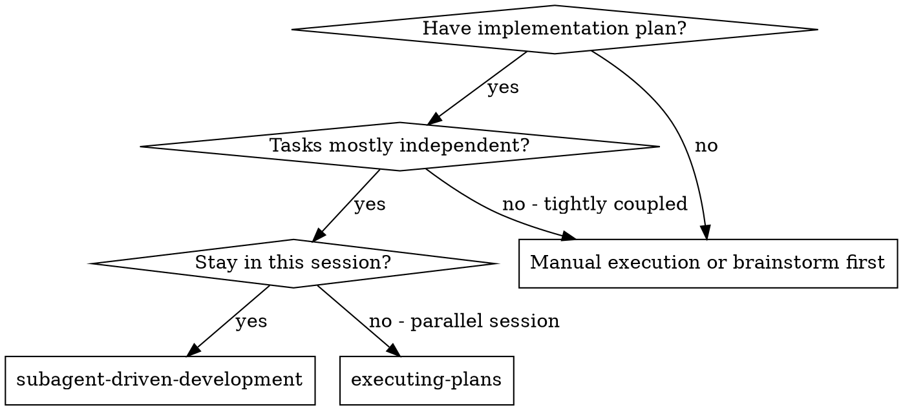
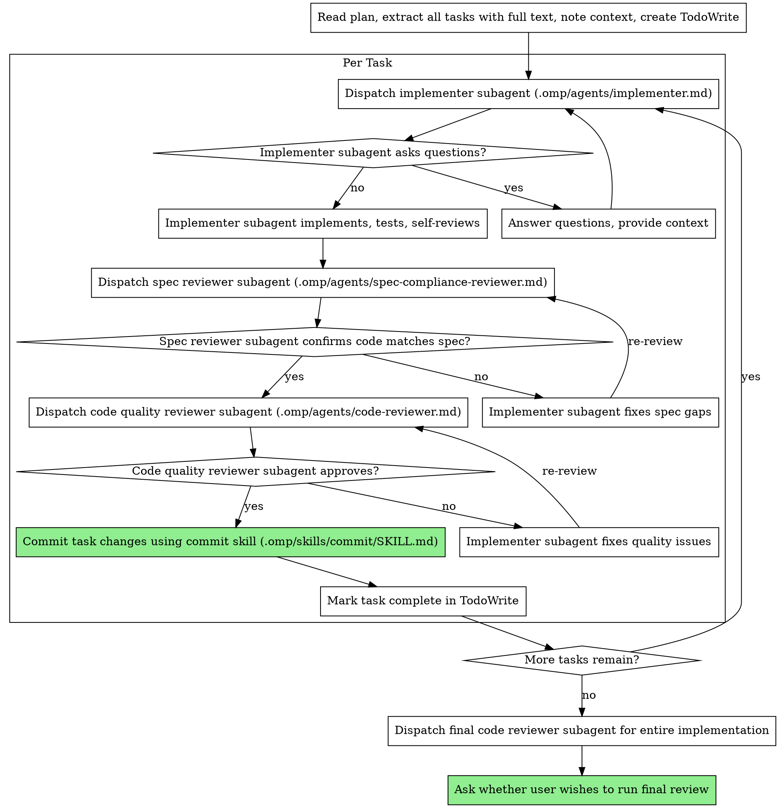

# Execute Implementation Plan

Execute plan by dispatching fresh subagent per task, with two-stage review after each (spec compliance then code quality), followed by a per-task commit once both reviews pass.

**Why subagents:** You delegate tasks to specialized agents with isolated context. By precisely crafting their instructions and context, you ensure they stay focused and succeed at their task. They should never inherit your session's context or history — you construct exactly what they need. This also preserves your own context for coordination work.

**Core principle:** Fresh subagent per task + two-stage review (spec then quality) = high quality, fast iteration

## ALWAYS REMEMBER

Before doing ANYTHING, read through `AGENTS.md` and adhere to those guidelines.

## When to Use



## The Process



## Model Selection

Use the least powerful model that can handle each role to conserve cost and increase speed.

| Agent Type                                  | Model | Rationale                                                                |
| ------------------------------------------- | ----- | ------------------------------------------------------------------------ |
| **Implementer** (mechanical implementation) | TASK  | Most implementation tasks are mechanical when the plan is well-specified |
| **Implementer** (integration/judgment)      | SLOW  | Multi-file coordination, pattern matching, debugging                     |
| **Spec Reviewer**                           | SLOW  | Requires understanding and judgment                                      |
| **Code Quality Reviewer**                   | SLOW  | Requires deep expertise and nuance                                       |

**Task complexity signals:**

- Touches 1-2 files with a complete spec → TASK model
- Touches multiple files with integration concerns → SLOW model
- Requires design judgment or broad codebase understanding → SLOW model

## Handling Implementer Status

Implementer subagents report one of four statuses. Handle each appropriately:

**DONE:** Proceed to spec compliance review.

**DONE_WITH_CONCERNS:** The implementer completed the work but flagged doubts. Read the concerns before proceeding. If the concerns are about correctness or scope, address them before review. If they're observations (e.g., "this file is getting large"), note them and proceed to review.

**NEEDS_CONTEXT:** The implementer needs information that wasn't provided. Provide the missing context and re-dispatch.

**BLOCKED:** The implementer cannot complete the task. Assess the blocker:

1. If it's a context problem, provide more context and re-dispatch with the same model
2. If the task requires more reasoning, re-dispatch with a more capable model
3. If the task is too large, break it into smaller pieces
4. If the plan itself is wrong, escalate to the human

**Never** ignore an escalation or force the same model to retry without changes. If the implementer said it's stuck, something needs to change.

## Prompt Templates

- `.omp/agents/implementer.md` - Dispatch implementer subagent
- `.omp/agents/spec-compliance-reviewer.md` - Dispatch spec compliance reviewer subagent
- `.omp/agents/code-reviewer.md` - Dispatch code quality reviewer subagent

## Per-Task Commit Workflow

After both spec compliance AND code quality reviews have approved a task's implementation, commit the changes before moving to the next task.

**Prerequisites (ALL must be met before committing):**
1. ✅ Spec compliance reviewer approved (no issues)
2. ✅ Code quality reviewer approved (no critical or important issues)

**Commit process:**
Follow the commit skill (`.omp/skills/commit/SKILL.md`) three-phase workflow:
1. **Analyze** — `git status`, `git diff` to inspect changes
2. **Propose** — Present commit plan to user for approval
3. **Execute** — Stage and commit after user approval

**NEVER:**
- Commit before both reviews pass
- Skip the commit skill's user-approval step
- Combine multiple tasks into one commit (one commit per task)

## Example Workflow

**Plan locations:** Implementation plans can be in one of four locations depending on category:

- `docs/specs/implementation/mvp/first-pass/` — MVP-FIRST-PASS
- `docs/specs/implementation/mvp/refactor/` — MVP-REFACTOR
- `docs/specs/implementation/features/<feature>/first-pass/` — FEATURE-FIRST-PASS
- `docs/specs/implementation/features/<feature>/refactor/` — FEATURE-REFACTOR

Each plan directory contains an `INDEX.md` overview and individual `task-*.md` files.

```
You: I'm using Subagent-Driven Development to execute this plan.

[Read plan directory once: docs/specs/implementation/mvp/first-pass/]
[Read INDEX.md to understand the full plan]
[Extract all tasks with full text and context from each task-*.md file]
[Create TodoWrite with all tasks]

Task 1: [Task name from INDEX.md]

[Get Task 1 text and context (already extracted)]
[Dispatch implementation subagent with full task text + context]

Implementer: "Before I begin - should the hook be installed at user or system level?"

You: "User level (~/.omp/hooks/)"

Implementer: "Got it. Implementing now..."
[Later] Implementer:
  - Implemented install-hook command
  - Added tests, 5/5 passing
  - Self-review: Found I missed --force flag, added it

[Dispatch spec compliance reviewer]
Spec reviewer: ✅ Spec compliant - all requirements met, nothing extra

[Get git SHAs, dispatch code quality reviewer]
Code reviewer: Strengths: Good test coverage, clean. Issues: None. Approved.

[Invoke commit skill to commit Task 1 changes]
Commit: feat(scope): install-hook command with --force flag

[Mark Task 1 complete]

Task 2: Recovery modes

[Get Task 2 text and context (already extracted)]
[Dispatch implementation subagent with full task text + context]

Implementer: [No questions, proceeds]
Implementer:
  - Added verify/repair modes
  - 8/8 tests passing
  - Self-review: All good

[Dispatch spec compliance reviewer]
Spec reviewer: ❌ Issues:
  - Missing: Progress reporting (spec says "report every 100 items")
  - Extra: Added --json flag (not requested)

[Implementer fixes issues]
Implementer: Removed --json flag, added progress reporting

[Spec reviewer reviews again]
Spec reviewer: ✅ Spec compliant now

[Dispatch code quality reviewer]
Code reviewer: Strengths: Solid. Issues (Important): Magic number (100)

[Implementer fixes]
Implementer: Extracted PROGRESS_INTERVAL constant

[Code reviewer reviews again]
Code reviewer: ✅ Approved

[Invoke commit skill to commit Task 2 changes]
Commit: feat(scope): verify/repair recovery modes

[Mark Task 2 complete]

...

[After all tasks]
[Dispatch final code-reviewer]
Final reviewer: All requirements met, ready to merge

Done! All tasks have been individually committed after passing both reviews, so no final /commit step is needed.
```

## Advantages

**vs. Manual execution:**

- Subagents follow TDD naturally
- Fresh context per task (no confusion)
- Parallel-safe (subagents don't interfere)
- Subagent can ask questions (before AND during work)

**Efficiency gains:**

- No file reading overhead (controller provides full text)
- Controller curates exactly what context is needed
- Subagent gets complete information upfront
- Questions surfaced before work begins (not after)

**Quality gates:**

- Self-review catches issues before handoff
- Two-stage review: spec compliance, then code quality
- Review loops ensure fixes actually work
- Spec compliance prevents over/under-building
- Code quality ensures implementation is well-built

**Cost:**

- More subagent invocations (implementer + 2 reviewers per task)
- Controller does more prep work (extracting all tasks upfront)
- Review loops add iterations
- But catches issues early (cheaper than debugging later)

## Iteration Limits

Prevent infinite loops with explicit limits:

| Limit Type        | Maximum | Action When Exceeded                           |
| ----------------- | ------- | ---------------------------------------------- |
| **Test attempts** | 5       | Report to user with failing tests and analysis |
| **Review cycles** | 3       | Report to user with blocking issues            |

When hitting limits, provide clear summary of what's blocking and ask user for guidance.

## Red Flags

**Never:**

- Start implementation on main/master branch without explicit user consent
- Skip reviews (spec compliance OR code quality)
- Proceed with unfixed issues
- Dispatch multiple implementation subagents in parallel (conflicts)
- Make subagent read plan file (provide full text instead)
- Skip scene-setting context (subagent needs to understand where task fits)
- Ignore subagent questions (answer before letting them proceed)
- Accept "close enough" on spec compliance (spec reviewer found issues = not done)
- Skip review loops (reviewer found issues = implementer fixes = review again)
- Let implementer self-review replace actual review (both are needed)
- **Start code quality review before spec compliance is ✅** (wrong order)
- Move to next task while either review has open issues
- **Commit before both reviews have approved** (spec compliance AND code quality must both pass before committing)

**If subagent asks questions:**

- Answer clearly and completely
- Provide additional context if needed
- Don't rush them into implementation

**If reviewer finds issues:**

- Implementer (same subagent) fixes them
- Reviewer reviews again
- Repeat until approved
- Don't skip the re-review

**If subagent fails task:**

- Dispatch fix subagent with specific instructions
- Don't try to fix manually (context pollution)

## Integration

**Subagents should use:**

- **test-driven-development (`.omp/skills/test-driven-development/SKILL.md`)** - Subagents follow TDD for each task
- **clean-code-rules (`.omp/skills/execute-plan/clean-code-rules.md`)** - Subagents follow these clean code guidelines for all implementation
- **commit (`.omp/skills/commit/SKILL.md`)** - Commit each task's changes after both reviews pass
