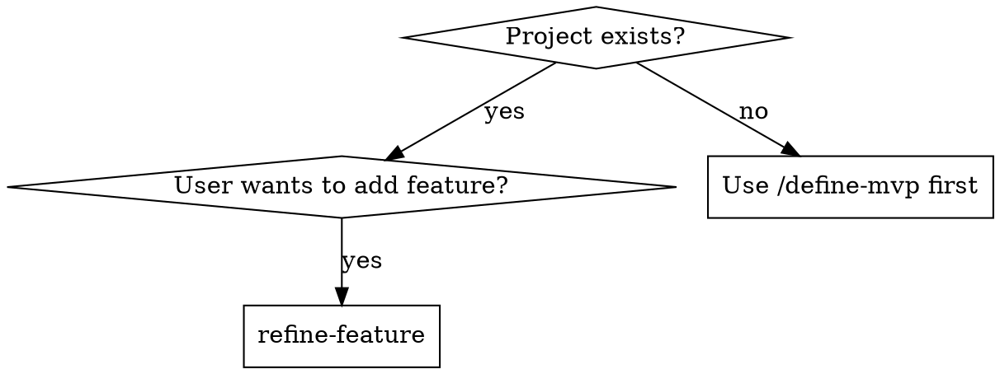
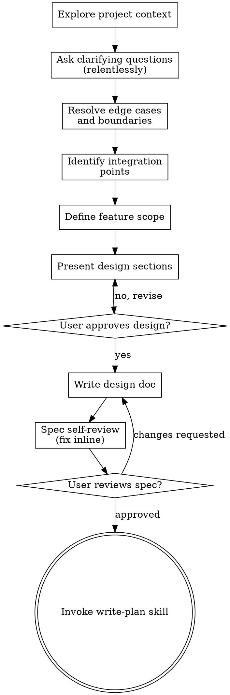

# Refine Feature Design Spec

Transform feature ideas into detailed design specs that integrate with the existing project.

## Overview

This skill applies **relentless systematic inquiry** to extract clarity and scope for features in existing projects. It requires understanding how the new feature interacts with existing code, architecture, and patterns — and resolving every edge case, failure mode, and boundary condition before the spec is written.

**Core principle:** One question at a time, relentlessly probe every branch, understand project context first, ensure integration with existing code.

## Relentless Inquiry

This skill does not ask the minimum — it asks until every branch of the decision tree is resolved. One question at a time, but NO question skipped. Every assumption probed, every edge case walked, every failure mode confronted.

**Inquiry rules:**

1. **Provide your recommended answer for every question.** Don't ask open-ended questions without showing your reasoning. Present your recommendation and let the user confirm, reject, or refine it.
2. **If a question can be answered by exploring the codebase or researching, do that instead of asking.** Prefer investigation over interrogation. Only ask when the answer genuinely requires the user's judgment.
3. **Walk every branch of the decision tree.** When a decision has multiple paths, trace each to its conclusion before moving on. Don't collapse branches prematurely.
4. **Never accept vagueness as resolution.** If the user says "I'm not sure" or "whatever you think", provide your recommendation with explicit reasoning and ask them to confirm or reject it.
5. **Edge cases are requirements, not afterthoughts.** Every feature has boundary conditions, failure modes, adversarial inputs, and partial states. These must be resolved in the spec, not discovered during implementation.
6. **Assumptions must be explicit.** Every assumption you're making — about existing code, data shapes, user behavior, deployment — write it down. Unstated assumptions are untested assumptions.
7. **Challenge "simple" and "obvious".** The simpler something seems, the more likely it hides unexamined assumptions. Double down on questioning when things seem straightforward.

## ALWAYS REMEMBER

Before doing ANYTHING, read through `AGENTS.md` and adhere to those guidelines.

<HARD-GATE>
Do NOT invoke any implementation skill, write any code, scaffold any project, or take any implementation action until you have presented a design and the user has approved it. This applies to EVERY feature regardless of perceived simplicity.
</HARD-GATE>

## Anti-Pattern: "This Is Too Simple To Need A Design"

Every feature goes through this process. A simple helper function, a config change, a small UI addition — all of them. "Simple" features are where unexamined assumptions cause the most wasted work. The design can be short (a few sentences for truly simple features), but you MUST present it and get approval.

## When to Use



**Use when:**

- Adding a feature to an existing project
- The project has existing architecture, patterns, and code
- User has an idea (vague or well-defined) for a new feature

**What changes based on clarity:**

- Vague ideas → More exploration questions (problem space, integration points, existing patterns, edge cases)
- Defined concepts → Skip to integration, edge cases, and technical approach directly

**Don't use when:**

- No project exists yet → Use `/define-mvp` first
- Simple one-line changes → Just implement directly

## Checklist

You MUST create a task for each of these items and complete them in order:

1. **Explore project context** — check files, docs, recent commits, existing patterns
2. **Ask clarifying questions** — relentlessly, one at a time, provide recommended answers
3. **Resolve edge cases and boundaries** — walk every branch of the decision tree
4. **Identify integration points** — where does this connect to existing code?
5. **Define feature scope** — distinguish must-have from nice-to-have
6. **Present design sections** — in sections scaled to complexity, get approval after each
7. **Write design doc** — save to `docs/specs/design/features/<feature-name>/` with all resolved details
8. **Spec self-review** — check for placeholders, contradictions, missing edge cases, ambiguity, scope
9. **User reviews written spec** — ask user to review spec file before proceeding
10. **Transition to implementation** — invoke write-plan skill to create implementation plan

## Process Flow



**The terminal state is invoking write-plan.** Do NOT invoke execute-plan, or any other implementation skill. The ONLY skill you invoke after this process is write-plan.

## The Process

### Phase 1: Explore Project Context

**This is the key difference from generic design skills.** Before discussing the feature, understand the existing project:

1. **Read project structure** — What's the architecture?
2. **Identify patterns** — How is code organized? What conventions exist?
3. **Find similar features** — Is there existing code this feature should follow?
4. **Check design specs** — If related feature specs exist, read them for context
5. **Assess scope** — If request describes multiple independent features, flag immediately
6. **Identify existing error handling** — How does the project handle failures? What patterns exist?
7. **Map data flow** — How does data move through the project? Where does the new feature fit?
8. **Check test patterns** — How are tests structured? What testing utilities exist?

**Output:** Mental model of the project that informs all subsequent questions. This model must include error handling patterns, data flow, and existing edge case handling — not just file structure.

### Phase 2: Explore Feature Intent

Ask questions one at a time. **Adapt depth based on concept clarity, but never skip edge cases:**

**For vague ideas** (ask these one at a time, provide your recommended answer):

1. **What problem does this solve?** — For existing users? For the system? My recommendation: [your analysis]
2. **Where does it fit?** — Which part of the application? My recommendation: [your analysis]
3. **Who uses it?** — All users? Specific roles? My recommendation: [your analysis]
4. **Success criteria** — How do we know this works? My recommendation: [your analysis]
5. **Failure criteria** — What would make this feature not worth adding? My recommendation: [your analysis]
6. **Hard constraints** — What must NOT change? What can't we break? My recommendation: [your analysis]
7. **Assumptions you're making** — About existing code? About data? About users? My recommendation: [your analysis]
8. **Anti-requirements** — What must this explicitly NOT do? My recommendation: [your analysis]
9. **Who might misuse this?** — What would adversarial or careless usage look like? My recommendation: [your analysis]
10. **Good enough vs perfect** — What's the minimum acceptable quality? My recommendation: [your analysis]

**For well-defined concepts** (skip or accelerate intent questions, but NOT edge cases):

- Validate understanding: "So you want to add [X] to [Y] to solve [Z]. Sound right?"
- Still probe: "What happens when [Z] can't be fully solved in this context?"
- Still probe: "What are the edge cases of [X] in the existing system?"
- Move directly to integration and edge case questions

**Always ask one question at a time.** Wait for the answer before proceeding.

### Phase 3: Resolve Edge Cases and Boundaries

**This is the grill-me phase.** Walk every branch of the decision tree, resolving dependencies between decisions one by one. Do not proceed until every identified edge case has a resolution.

Ask these one at a time, providing your recommended answer:

1. **Existing data boundary conditions** — Empty data, max-size data, malformed data, concurrent modifications? What does the existing system assume? My recommendation: [your analysis]
2. **Impact on existing features** — Does this change any existing behavior? What regressions are possible? My recommendation: [your analysis]
3. **Adversarial inputs** — What's the worst input a user could provide through this feature? What's the worst sequence of actions? My recommendation: [your analysis]
4. **Partial and inconsistent states** — What states can the system be in between operations? What if an operation is interrupted mid-way? How does the existing system handle this? My recommendation: [your analysis]
5. **Performance impact** — Does this feature add load to existing paths? What are the latency implications? My recommendation: [your analysis]
6. **Data migration** — Does existing data need to change? What's the migration strategy? What happens if migration fails partway? My recommendation: [your analysis]
7. **Backward compatibility** — Does this break any existing contracts? Can existing consumers handle the change? My recommendation: [your analysis]
8. **Concurrent access** — Multiple users accessing the same data? Race conditions with existing features? My recommendation: [your analysis]
9. **Security boundaries** — Does this expose any new attack surface? Who should and shouldn't access this? My recommendation: [your analysis]
10. **Rollback** — If this feature causes problems in production, can it be disabled? What's the rollback plan? My recommendation: [your analysis]
11. **Invariants** — What must always be true, in the existing system and with the new feature? My recommendation: [your analysis]
12. **Degradation** — When this feature's dependencies fail, what does the user experience? How does the rest of the system behave? My recommendation: [your analysis]

**For each edge case, the resolution must be explicit in the spec.** "Handle gracefully" is not a resolution — specify exactly what happens.

**If the user says "that won't happen":** Explore the codebase to verify. If it truly can't happen, record it as an explicit assumption. If it could, provide your reasoning and ask them to confirm exclusion.

### Phase 4: Identify Integration Points

This is the critical phase for feature design. Ask (one at a time, with recommendations):

1. **Where does this connect?** — Which existing modules/components? My recommendation: [your analysis]
2. **What does it need from existing code?** — Data? Services? Events? State? My recommendation: [your analysis]
3. **What impact does it have?** — Does it change existing behavior? How? My recommendation: [your analysis]
4. **Does it follow existing patterns?** — Or does it need new patterns? If new, why? My recommendation: [your analysis]
5. **What existing error handling does it depend on?** — Does the feature need to integrate with existing error boundaries? My recommendation: [your analysis]
6. **What existing tests does it affect?** — Do any existing tests need to change? Why? My recommendation: [your analysis]
7. **What logging and observability exists?** — How will we know this feature is working or broken in production? My recommendation: [your analysis]
8. **What configuration does it need?** — Feature flags? Environment variables? Existing config patterns? My recommendation: [your analysis]

**Output:** Clear understanding of how the feature integrates with existing codebase, including every touchpoint and its implications.

### Phase 5: Define Feature Scope

Work with user to distinguish essential from nice-to-have:

1. **Core functionality** — What must this feature do?
2. **Nice-to-have** — What can be deferred?
3. **Integration requirements** — What must change in existing code?
4. **Testing strategy** — How do we verify this works?

**For each proposed feature, ask (one at a time):**

- What's the smallest version of this that delivers value?
- What happens if we cut this entirely? What breaks?
- What's the cost of including it? (code complexity, maintenance burden, testing surface, existing code impact)
- What dependencies does it have on other features?
- What edge cases does it introduce?
- How will we know it's working correctly? How will we know it's broken?
- What's the failure mode when this feature fails?

**My recommendation for each:** [provide your analysis of whether this belongs in scope and why]

**Apply YAGNI ruthlessly** — Challenge every feature. **User has final say** — If the user insists a feature is required, accept it (but challenge first).

### Phase 6: Present Design

Once you understand what you're building and how it integrates:

- Scale each section to its complexity: a few sentences if straightforward, up to 200-300 words if nuanced
- Ask after each section whether it looks right so far
- Cover: architecture, components, data flow, integration points, error handling, testing, edge cases, failure modes
- Be ready to go back and clarify if something doesn't make sense

**Design for integration:**

- Follow existing patterns where possible
- Where existing code has problems that affect the work, include targeted improvements
- Don't propose unrelated refactoring. Stay focused on what serves the current goal

### Phase 7: Write Design Spec

Create the design document at:
`docs/specs/design/features/<feature-name>/YYYY-MM-DD-<project-name>-<feature-name>-design-spec.md`
(User preferences for spec location override this default)

**Structure:**

```markdown
# [Feature Name] - Design Spec

## Context

[Project overview, why this feature, relationship to existing features]

## Problem Statement

[The specific problem this feature solves]

## Assumptions and Constraints

[Every assumption made during design — about existing code, data shapes, user behavior, deployment]
- [Assumption 1]: [why we believe this, what happens if wrong]
- [Assumption 2]: [why we believe this, what happens if wrong]

### Hard Constraints

- [Constraint 1: e.g., must not break existing API, must work with current DB schema]
- [Constraint 2]

## Anti-Requirements

[What this must explicitly NOT do — boundaries that prevent scope creep]
- [Anti-requirement 1]: [why excluded]
- [Anti-requirement 2]: [why excluded]

## Feature Scope

### Must-haves (Phase 1)

#### Feature 1

- Purpose: [why this feature exists]
- Behavior: [what it does, including edge cases and boundary conditions]
- Failure mode: [what happens when this feature fails or is used incorrectly]
- Decisions made: [key design decisions and rationale]

#### Feature 2

- Purpose: [why this feature exists]
- Behavior: [what it does, including edge cases and boundary conditions]
- Failure mode: [what happens when this feature fails or is used incorrectly]
- Decisions made: [key design decisions and rationale]

### Nice-to-have (Phase 2+, defer)

- Feature A: [brief description, why deferred]
- Feature B: [brief description, why deferred]

## Integration Points

### Existing Code Affected

- `path/to/file.ext` — [what changes and why]

### New Code Required

- `path/to/new/file.ext` — [purpose]

### Data Changes

- [New data structures, migrations, etc.]

### API Changes

- [New endpoints, modified responses, etc.]

## Edge Cases and Boundary Conditions

[All edge cases identified during inquiry, with resolution for each]
- [Edge case 1]: [resolution]
- [Edge case 2]: [resolution]

## Failure Modes and Degradation

[How the feature behaves when things go wrong, consistent with existing patterns]
- [Failure mode 1]: [detection, response, recovery]
- [Failure mode 2]: [detection, response, recovery]

## Architecture

### Component Design

[How the feature is structured, following existing patterns]

### Data Flow

[How data moves through the feature]

### Error Handling

[How errors are handled, consistent with existing patterns]

## Invariants

[System properties that must always hold, regardless of state]
- [Invariant 1]
- [Invariant 2]

## Tech Stack

[Any new dependencies or technologies required]

## Testing Strategy

- Unit tests: [what to test]
- Integration tests: [what to test]
- E2E tests: [what to test]

## Success Criteria

- [Criterion 1: specific, testable]
- [Criterion 2: specific, testable]

## Risks and Mitigations

- Risk: [description] → Mitigation: [how to address]

## Decision Log

[Record of key decisions made during design, with reasoning]

| Decision | Options Considered | Chosen | Rationale |
|----------|-------------------|--------|-----------|
| [Decision 1] | [A, B, C] | [A] | [why] |
| [Decision 2] | [X, Y] | [Y] | [why] |
```

### Phase 8: User Approval

Present the spec to the user:

> "Design spec written to `[path]`. Key points: [2-3 sentence summary]. Does this capture your vision and the integration requirements? Any changes before we proceed?"

Wait for approval. Iterate if needed.

### Phase 9: Spec Self-Review

After writing the spec document, look at it with fresh eyes:

1. **Placeholder scan:** Any "TBD", "TODO", incomplete sections, or vague requirements? Fix them.
2. **Internal consistency:** Do any sections contradict each other? Does the architecture match the feature descriptions?
3. **Integration check:** Are all integration points with existing code identified?
4. **Scope check:** Is this focused enough for a single implementation plan, or does it need decomposition?
5. **Ambiguity check:** Could any requirement be interpreted two different ways? If so, pick one and make it explicit.
6. **Edge case coverage:** Are all identified edge cases from Phase 3 addressed? Any edge cases missing?
7. **Assumption audit:** Are all assumptions explicit? Any assumptions that are "obvious" but unstated?
8. **Failure mode coverage:** Does the design handle every identified failure mode? Or are some left to "handle gracefully" without specifics?
9. **Invariant verification:** Are all invariants testable? Could any be violated by the described behavior or existing code?

Fix any issues inline. No need to re-review — just fix and move on.

### Phase 10: User Reviews Spec

After the spec review loop passes, ask the user to review the written spec before proceeding:

> "Spec written and committed to `<path>`. Please review it and let me know if you want to make any changes before we start creating the implementation plan."

Wait for the user's response. If they request changes, make them and re-run the spec review loop. Only proceed once the user approves.

### Phase 11: Transition to Implementation

Once the design spec is approved:

> "Ready to break this down into actionable tasks. Would you like to proceed with `/write-plan`?"

Do NOT invoke implementation skills directly—let the user decide when to proceed.

## Quick Reference

| Question Type         | Purpose                 | Example                                               |
| --------------------- | ----------------------- | ----------------------------------------------------- |
| Context gathering     | Understand project      | "How is authentication handled currently?"            |
| Problem extraction    | Identify the pain point | "What's frustrating about the current workflow?"      |
| Integration discovery | Find connection points  | "Where should this feature appear in the UI?"         |
| Pattern matching      | Ensure consistency      | "Should this follow the existing X pattern?"          |
| Impact assessment     | Understand changes      | "Does this affect existing users?"                    |
| Success criteria      | Define "done"           | "What makes this successful vs failure?"              |
| Edge case probing     | Find hidden assumptions | "What happens when existing data is in state X?"      |
| Failure mode mapping  | Ensure graceful handling| "What does the user see when this service is down?"   |
| Adversarial thinking  | Find security/misuse    | "What's the worst input someone could provide here?"  |
| Invariant checking    | Ensure system integrity | "What must always be true in the data model?"         |
| Assumption surfacing  | Make implicit explicit  | "What are you assuming about the existing codebase?"  |
| Regression checking   | Prevent breaking changes| "Which existing tests might this feature affect?"     |

## Key Principles

- **Explore existing code first** — Understand project context before proposing changes
- **One question at a time** — Don't overwhelm with multiple questions
- **Provide your recommended answer** — Show your reasoning, let the user confirm or reject
- **Explore before asking** — If the codebase can answer the question, look there first
- **Multiple choice preferred** — Easier to answer than open-ended when possible
- **YAGNI ruthlessly** — Remove unnecessary features from all designs
- **Identify integration points** — Explicitly map how the feature connects to existing code
- **Incremental validation** — Present design, get approval before moving on
- **Walk every branch** — Trace each decision path to its conclusion
- **Be flexible** — Go back and clarify when something doesn't make sense
- **User has final say** — If the user insists a feature is required, accept it (but challenge first)
- **Edge cases are requirements** — Resolve them in the spec, not during implementation
- **Assumptions must be explicit** — Unstated assumptions are untested assumptions

## Common Mistakes

| Mistake                                   | Fix                                                        |
| ----------------------------------------- | ---------------------------------------------------------- |
| Skipping project exploration              | Always understand existing code first                       |
| Asking multiple questions at once         | One question per message                                   |
| Asking without providing a recommendation | Always show your reasoning and recommendation              |
| Assuming requirements prematurely         | Ask, don't guess                                           |
| Ignoring existing patterns                | New features should follow established patterns             |
| Including non-MVP features "just in case"  | YAGNI ruthlessly                                          |
| Missing integration points                | Explicitly identify what existing code is affected          |
| Forgetting testing strategy               | Define how to verify the feature works                     |
| Writing vague requirements                | Make each testable: "user can X in Y seconds"              |
| Overriding user's scope definition        | User has final say—challenge, then accept                  |
| Proceeding without user approval          | Always get explicit approval before implementation          |
| Skipping edge case resolution             | Walk every branch of the decision tree                     |
| Accepting "handle gracefully" as a plan   | Specify exactly what happens on failure                    |
| Leaving assumptions implicit              | Record every assumption with justification and risk         |

## Red Flags

**STOP if you're about to:**

- Skip exploring the existing project
- Propose patterns that contradict existing code
- Forget to identify integration points
- Create a spec without testing strategy
- Proceed without user approval
- Write implementation code before design is approved
- Skip edge case resolution because "it won't happen"
- Accept "TBD" or "handle gracefully" in the spec
- Leave an assumption unstated
- Miss a regression risk to existing features

**All of these mean: You're not properly integrating with the existing project. The spec will have holes.**

## Transition Out

Once the design spec is approved:

> "Ready to break this down into actionable tasks. Would you like to proceed with `/write-plan`?"

Do NOT invoke implementation skills directly—let the user decide when to proceed.
