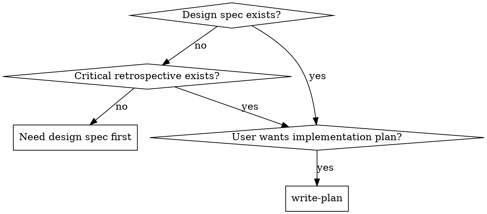
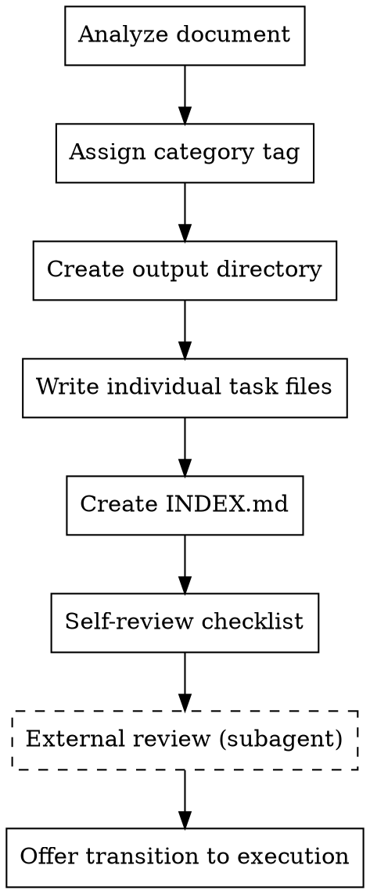
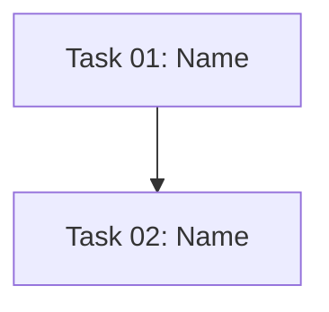

# Plan Implementation

## Overview

Write comprehensive implementation plans as individual task files with an INDEX.md overview. Assume the engineer has zero context for our codebase and questionable taste. Document everything they need to know: which files to touch for each task, code, testing, docs they might need to check, how to test it. Give them the whole plan as bite-sized tasks. DRY. YAGNI. TDD.

Assume they are a skilled developer, but know almost nothing about our toolset or problem domain. Assume they don't know good test design very well.

**Core principle:** Every task gets its own file, every task has test criteria, dependencies are explicit.

## ALWAYS REMEMBER

Before doing ANYTHING, read through `AGENTS.md` and adhere to those guidelines.

## When to Use



**Use when:**

- Design spec exists at `docs/specs/design/mvp` or `docs/specs/design/features/<feature-name>`
- Critical retrospective exists at `docs/specs/implementation/mvp` or `docs/specs/implementation/features/<feature-name>`
- User wants to break down work into actionable tasks

**Don't use when:**

- No design spec or retrospective exists → Use `/define-mvp` or `/refine-feature` first
- Only simple one-line changes needed → Manual execution is faster

## Category Tags

Before creating tasks, analyze the input document and assign a tag:

| Tag                  | Input Location                                                                                       | Output Location                                            |
| -------------------- | ---------------------------------------------------------------------------------------------------- | ---------------------------------------------------------- |
| `MVP-FIRST-PASS`     | `docs/specs/design/mvp/YYYY-MM-DD-<topic>-mvp-design.md`                                             | `docs/specs/implementation/mvp/first-pass/`                |
| `MVP-REFACTOR`       | `docs/specs/implementation/mvp/YYYY-MM-DD-mvp-critical-retrospective-<project>`                      | `docs/specs/implementation/mvp/refactor/`                  |
| `FEATURE-FIRST-PASS` | `docs/specs/design/features/<feature>/first-pass/YYYY-MM-DD-<feature>-design-spec-<project>`         | `docs/specs/implementation/features/<feature>/first-pass/` |
| `FEATURE-REFACTOR`   | `docs/specs/implementation/features/<feature>/YYYY-MM-DD-<feature>-critical-retrospective-<project>` | `docs/specs/implementation/features/<feature>/refactor/`   |

**If refactoring more than once:** Move existing task files to `v1/`, create new ones in `v2/`

## Process Flow



## File Structure Guidance

Before defining tasks, map out which files will be created or modified and what each one is responsible for. This is where decomposition decisions get locked in.

- Design units with clear boundaries and well-defined interfaces. Each file should have one clear responsibility.
- You reason best about code you can hold in context at once, and your edits are more reliable when files are focused. Prefer smaller, focused files over large ones that do too much.
- Files that change together should live together. Split by responsibility, not by technical layer.
- In existing codebases, follow established patterns. If the codebase uses large files, don't unilaterally restructure - but if a file you're modifying has grown unwieldy, including a split in the plan is reasonable.

This structure informs the task decomposition. Each task should produce self-contained changes that make sense independently.

## Bite-Sized Task Granularity

**Each step is one action (2-5 minutes):**

- "Write the failing test" - step
- "Run it to make sure it fails" - step
- "Implement the minimal code to make the test pass" - step
- "Run the tests and make sure they pass" - step

## The Process

### Step 1: Analyze and Categorize

1. Read the provided design spec or critical retrospective
2. Determine which category tag applies (see table above)
3. Identify the feature name if applicable (from the document)

### Step 2: Prepare Output Directory

1. Create the output directory based on the category tag
2. If this is a refactor and files already exist:
   - Create `v1/` subdirectory
   - Move existing task files and `INDEX.md` into it
   - New files go in the main directory (or `v2/` if v1 exists)

### Step 3: Write Individual Task Files

For each task identified from the spec, create a separate file following the Task File Structure below. Each file must include:

- Implementation steps with exact code
- Test criteria
- Dependencies
- Success criteria

### Step 4: Create INDEX.md

Create an index file in the task directory following the INDEX.md Structure below.

### Step 5: Self-Review

After writing all task files and INDEX.md, run the self-review checklist (see below).

### Step 6: External Review

Dispatch a plan document reviewer subagent to verify the complete plan:

```
Agent tool (general-purpose):
  description: "Review implementation plan"
  prompt: |
    You are a plan document reviewer. Verify this implementation plan is complete and ready for execution.

    Read your specification at: .omp/agents/plan-reviewer.md

    ## Plan Directory
    [Path to task directory with INDEX.md and task-*.md files]

    ## Source Document
    [Path to design spec or critical retrospective]

    Follow the plan-document-reviewer specification exactly.
```

**After review:**

- If approved → Proceed to Step 7
- If issues found → Fix the issues and re-run review

### Step 7: Offer Transition

> "Implementation plan created and approved at `[directory]`. Would you like to proceed with execution, or take a break?"

## Task File Structure

Each task file should follow this structure:

````markdown
# Task ## - [Task Name]

## Overview

[Brief description of what this task accomplishes]

## Files to Create/Modify

- Create: `path/to/file.ext`
- Modify: `path/to/existing.ext:line-range`
- Test: `tests/path/to/test.py`

## Steps

- [ ] **Step 1: Write the failing test**

```python
def test_specific_behavior():
    result = function(input)
    assert result == expected
```
````

- [ ] **Step 2: Run test to verify it fails**

Run: `pytest tests/path/test.py::test_name -v`
Expected: FAIL with "function not defined"

- [ ] **Step 3: Write minimal implementation**

```python
def function(input):
    return expected
```

- [ ] **Step 4: Run test to verify it passes**

Run: `pytest tests/path/test.py::test_name -v`
Expected: PASS

## Dependencies

- [What needs to exist before this task can start]

## Success Criteria

- [How to verify this task is complete]

## Tests

### Test 1: [Description]

**What to test:** [Brief description]

**Feasibility:** ✅ Can be tested | ⚠️ Dependent on [X] | ❌ Not testable because [Y]

## INDEX.md Structure

````markdown
# Implementation Plan Index

## Overview

[Brief description of what this plan implements]

## Category

[Category tag]

## Source Document

[Path to design spec or critical retrospective]

## Dependency Graph


````

## Task List

| Task | Name   | Complexity      | Dependencies |
| ---- | ------ | --------------- | ------------ |
| 01   | [Name] | Low/Medium/High | None         |
| 02   | [Name] | Low/Medium/High | Task 01      |

## Progress Tracking

- [ ] Task 01: [Name]
- [ ] Task 02: [Name]

```

## No Placeholders

Every step must contain the actual content an engineer needs. These are **plan failures** — never write them:
- "TBD", "TODO", "implement later", "fill in details"
- "Add appropriate error handling" / "add validation" / "handle edge cases"
- "Write tests for the above" (without actual test code)
- "Similar to Task N" (repeat the code — the engineer may be reading tasks out of order)
- Steps that describe what to do without showing how (code blocks required for code steps)
- References to types, functions, or methods not defined in any task

## Self-Review

After writing the complete plan, look at the spec with fresh eyes and check the plan against it. This is a checklist you run yourself.

**1. Spec coverage:** Skim each section/requirement in the spec. Can you point to a task that implements it? List any gaps.

**2. Placeholder scan:** Search your plan for red flags — any of the patterns from the "No Placeholders" section above. Fix them.

**3. Type consistency:** Do the types, method signatures, and property names you used in later tasks match what you defined in earlier tasks? A function called `clearLayers()` in Task 3 but `clearFullLayers()` in Task 7 is a bug.

If you find issues, fix them inline. No need to re-review — just fix and move on. If you find a spec requirement with no task, add the task.

## Remember
- Exact file paths always
- Complete code in every step — if a step changes code, show the code
- Exact commands with expected output
- DRY, YAGNI, TDD, frequent commits
- One file per task, always

## Common Mistakes

| Mistake | Fix |
|---------|-----|
| Consolidating tasks into one file | One file per task, always |
| Skipping test criteria | Every task needs tests defined |
| Vague subtasks | Be specific: exact files, exact changes |
| Missing dependencies | List all prerequisites explicitly |
| Creating tasks without source document | Always read design spec first |
| "Similar to Task N" references | Repeat the code — engineer may read out of order |
| Steps without code blocks | Code steps require actual code |

## Red Flags

**STOP if you're about to:**
- Create a file named `tasks-13-through-19.md` → One file per task
- Skip test criteria → Every task needs tests defined
- Proceed without categorizing → Tag determines output location
- Create tasks without reading the source document → Read first
- Write "TBD" or "TODO" in any step → No placeholders allowed
- Reference undefined types/functions → Define everything first

**All of these mean: You're violating the planning discipline. Stop and follow the process.**
```
