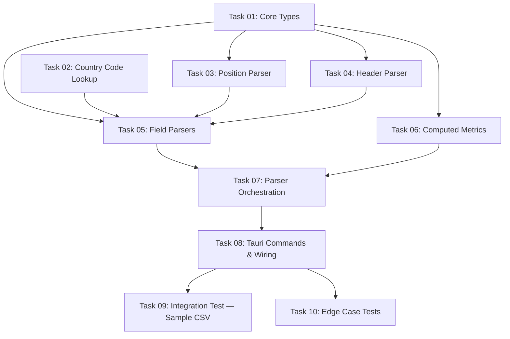

# Implementation Plan Index — CSV Parser

## Overview

Implements the CSV parser feature for FM ValueScout: a Rust backend module that reads Football Manager CSV exports, extracts and validates player data, computes derived metrics, and exposes two Tauri commands (`parse_csv`, `save_import`). This is the first feature built on a fresh Tauri v2 scaffold.

## Category

FEATURE-FIRST-PASS

## Source Document

`docs/specs/design/features/csv-parser/2026-04-29-fm-valuescout-csv-parser-design-spec.md`

## Dependency Graph

## Task List

| Task | Name                          | Complexity | Dependencies        |
| ---- | ----------------------------- | ---------- | ------------------- |
| 01   | Core Types & Stat Structs     | Medium     | None                |
| 02   | Country Code Lookup Table     | Low        | None                |
| 03   | Position String Parser        | Medium     | Task 01             |
| 04   | Header Parser                 | Medium     | Task 01             |
| 05   | Field Parsers                 | High       | Task 01, 02, 03, 04 |
| 06   | Computed Metrics              | Medium     | Task 01             |
| 07   | Parser Orchestration          | Medium     | Task 05, 06         |
| 08   | Tauri Commands & Wiring       | Medium     | Task 07             |
| 09   | Integration Test — Sample CSV | Medium     | Task 08             |
| 10   | Edge Case Tests               | Medium     | Task 08             |

## Progress Tracking

- [x] Task 01: Core Types & Stat Structs
- [x] Task 02: Country Code Lookup Table
- [x] Task 03: Position String Parser
- [x] Task 04: Header Parser
- [x] Task 05: Field Parsers
- [x] Task 06: Computed Metrics
- [x] Task 07: Parser Orchestration
- [x] Task 08: Tauri Commands & Wiring
- [x] Task 09: Integration Test — Sample CSV
- [x] Task 10: Edge Case Tests
