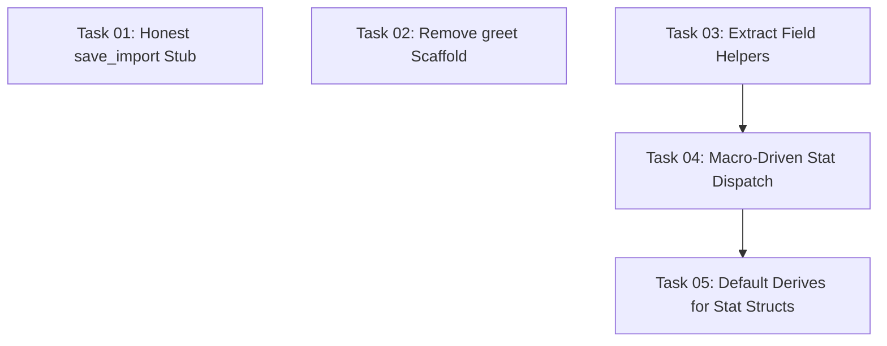

# Implementation Plan Index — CSV Parser Refactor

## Overview

Refactors the CSV parser feature based on the critical retrospective findings. Addresses the two P0 issues (dishonest `save_import` stub, leftover scaffold code) and the three P1 issues (repetitive field extraction boilerplate, fragile `assign_stat` synchronization, verbose `ParsedPlayer::empty()` constructor). The goal: fewer lines, single-location stat definitions, no silent data loss.

## Category

FEATURE-REFACTOR

## Source Document

`docs/specs/implementation/features/csv-parser/refactor/csv-parser-CRITICAL-RETROSPECTIVE-REPORT.md`

## Dependency Graph

## Task List

| Task | Name                                | Complexity | Dependencies |
| ---- | ----------------------------------- | ---------- | ------------ |
| 01   | Honest save_import Stub             | Low        | None         |
| 02   | Remove greet Scaffold               | Low        | None         |
| 03   | Extract Field Helpers               | Medium     | None         |
| 04   | Macro-Driven Stat Dispatch          | Medium     | Task 03      |
| 05   | Default Derives for Stat Structs    | Low        | Task 04      |

## Progress Tracking

- [x] Task 01: Honest save_import Stub
- [x] Task 02: Remove greet Scaffold
- [x] Task 03: Extract Field Helpers
- [x] Task 04: Macro-Driven Stat Dispatch
- [x] Task 05: Default Derives for Stat Structs
