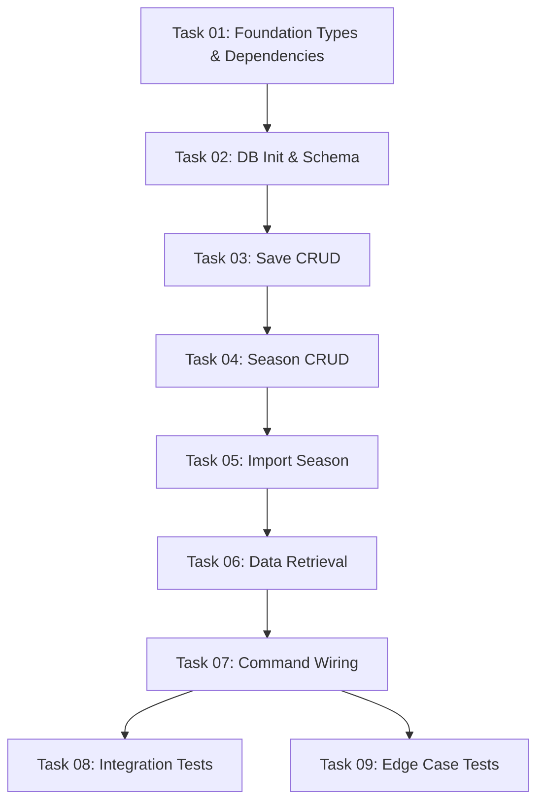

# Implementation Plan Index

## Overview

Replace the `save_import` stub with SQLite-backed persistence for FM ValueScout. Implement save-game isolation, seasonal snapshots, career timelines, and full CRUD for saves and seasons. All data persisted via rusqlite with a hybrid schema (queryable columns + JSON blob).

## Category

FEATURE-FIRST-PASS

## Source Document

`docs/specs/design/features/database-integration/2026-04-30-fm-valuescout-database-integration-design-spec.md`

## Dependency Graph

## Task List

| Task | Name                              | Complexity | Dependencies      |
| ---- | --------------------------------- | ---------- | ----------------- |
| 01   | Foundation Types & Dependencies   | Low        | None              |
| 02   | DB Init & Schema                  | Medium     | Task 01           |
| 03   | Save CRUD                         | Medium     | Task 01, 02       |
| 04   | Season CRUD                       | Medium     | Task 01, 02, 03   |
| 05   | Import Season                     | High       | Task 01, 02, 03   |
| 06   | Data Retrieval                    | Medium     | Task 01-05        |
| 07   | Command Wiring                    | Medium     | Task 01-06        |
| 08   | Integration Tests                 | Medium     | Task 01-07        |
| 09   | Edge Case Tests                   | Medium     | Task 01-07        |

## Progress Tracking

- [x] Task 01: Foundation Types & Dependencies
- [x] Task 02: DB Init & Schema
- [x] Task 03: Save CRUD
- [x] Task 04: Season CRUD
- [ ] Task 05: Import Season
- [ ] Task 06: Data Retrieval
- [ ] Task 07: Command Wiring
- [ ] Task 08: Integration Tests
- [ ] Task 09: Edge Case Tests
