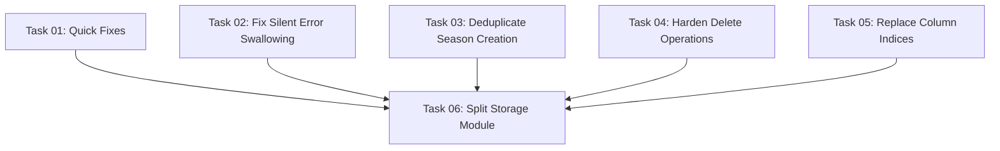

# Implementation Plan Index

## Overview

Refactor the database-integration storage layer based on the critical retrospective findings. Seven focused tasks eliminate dead code, fix silent error swallowing, deduplicate logic, harden delete operations, replace fragile column indices, and split the 1700-line monolith into focused files. No behavioral changes — all 219 existing tests must pass without modification.

## Category

FEATURE-REFACTOR

## Source Document

`docs/specs/implementation/features/database-integration/refactor/database-integration-CRITICAL-RETROSPECTIVE-REPORT.md`

## Dependency Graph

Tasks 01-05 are independent of each other and can be done in any order. Task 06 (module split) should be done last so it captures all prior fixes in the new file structure.

## Task List

| Task | Name                              | Complexity | Dependencies      |
| ---- | --------------------------------- | ---------- | ----------------- |
| 01   | Quick Fixes: Delete Dead Code & Fix created_at | Low | None |
| 02   | Fix Silent Error Swallowing       | Low        | None              |
| 03   | Deduplicate Season Creation       | Low        | None              |
| 04   | Harden Delete Operations          | Low        | None              |
| 05   | Replace Column Indices            | Low        | None              |
| 06   | Split Storage Module              | Medium     | Tasks 01-05       |

## Progress Tracking

- [ ] Task 01: Quick Fixes: Delete Dead Code & Fix created_at
- [ ] Task 02: Fix Silent Error Swallowing
- [ ] Task 03: Deduplicate Season Creation
- [ ] Task 04: Harden Delete Operations
- [ ] Task 05: Replace Column Indices
- [ ] Task 06: Split Storage Module
