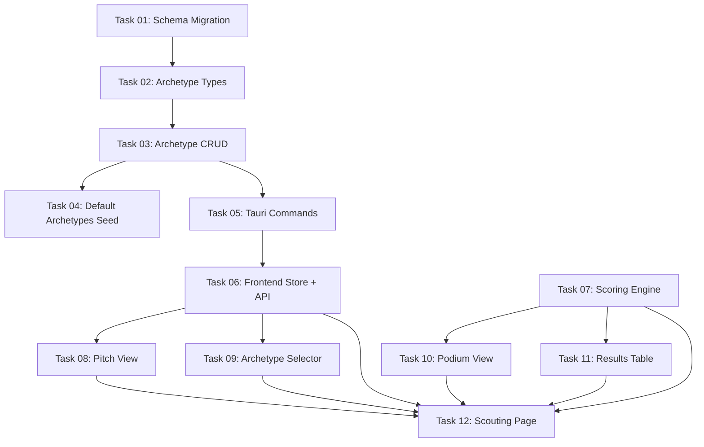

# Implementation Plan Index

## Overview

Implementation plan for the FM ValueScout Moneyball Scouting feature. This feature loads player data from CSV imports, scores players against configurable archetypes using weighted percentile sums, and presents results in a pitch-based UI with a top-3 podium and sortable results table.

## Category

FEATURE-FIRST-PASS

## Source Document

`docs/specs/design/features/scouting/2026-05-01-fm-valuescout-scouting-design-spec.md`

## Dependency Graph

## Task List

| Task | Name                          | Complexity | Dependencies          |
| ---- | ----------------------------- | ---------- | --------------------- |
| 01   | Schema Migration              | Low        | None                  |
| 02   | Archetype Types               | Low        | Task 01               |
| 03   | Archetype CRUD Storage Layer  | Medium     | Task 01, Task 02      |
| 04   | Default Archetypes Seed       | Medium     | Task 01, Task 02, Task 03 |
| 05   | Tauri Archetype Commands      | Low        | Task 02, Task 03      |
| 06   | Frontend Store + API          | Medium     | Task 05               |
| 07   | Scoring Engine (TypeScript)   | High       | Task 06 (types only)  |
| 08   | Pitch View Component          | Medium     | Task 06 (types only)  |
| 09   | Archetype Selector Component  | Medium     | Task 06 (types only)  |
| 10   | Podium View Component         | Low        | Task 07 (types only)  |
| 11   | Results Table Component       | Medium     | Task 07 (types only)  |
| 12   | Scouting Page Integration     | Medium     | All previous          |

## Parallelization Opportunities

- **Tasks 07, 08, 09** can be done in parallel after Task 06 (they only depend on types, not on each other)
- **Tasks 10, 11** can be done in parallel after Task 07
- **Task 12** is the integration point — must be done last

## Prerequisites

- **Vitest**: Installed and configured in Task 06. All frontend tasks (07–12) use `bun run test` (i.e., `vitest run`) for unit tests.
- **Rust toolchain**: Required for Tasks 01–05. Tests use `cargo test`.

## Progress Tracking

- [x] Task 01: Schema Migration
- [x] Task 02: Archetype Types
- [x] Task 03: Archetype CRUD Storage Layer
- [x] Task 04: Default Archetypes Seed
- [x] Task 05: Tauri Archetype Commands
- [x] Task 06: Frontend Store + API
- [x] Task 07: Scoring Engine (TypeScript)
- [x] Task 08: Pitch View Component
- [x] Task 09: Archetype Selector Component
- [x] Task 10: Podium View Component
- [x] Task 11: Results Table Component
- [ ] Task 12: Scouting Page Integration

# Note: This plan has been reviewed and corrected.
# Key fixes applied:
# - P0: $derived(() => ...) → $derived.by(() => ...) in Tasks 06, 10, 11, 12
# - P0: Metric key mappings corrected to match actual ParsedPlayer fields
# - P1: Full Database View added to Task 12
# - P1: Multi-position scoring addressed in Task 07